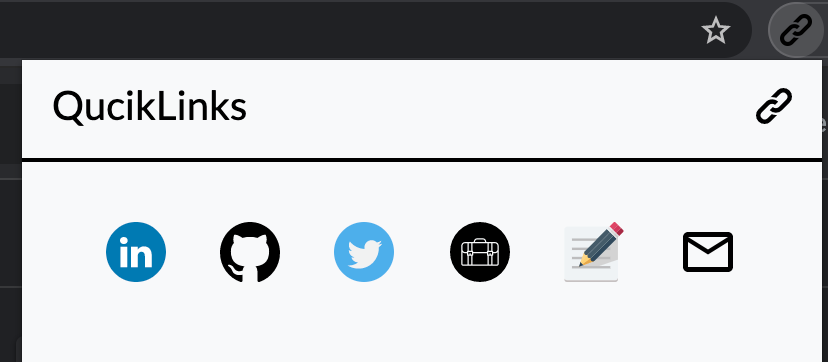
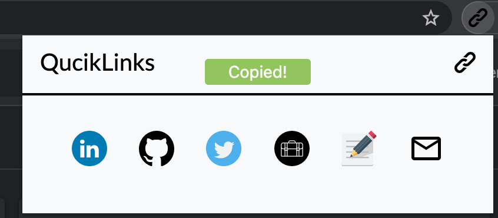

# QuickLinks - Chrome Extension

Being a fresher, I have to fill different job applications everyday and copying my LinkedIn, GitHub, Twitter handle links etc for mentioning in those forms become very difficult. So I made this extension which copies the link of the social media handles on the clipboard when you click on the icon.


> ### A chrome extension which helps you to copy important social media links to clipboard in a **faster way**.

## How to use it?

All the links to different social media handles are mentioned in the ```links.js```. You can go to that file and change the links. You can add new links as well. 
#### Make sure you add an icon for each new link you add otherwise it would throw an error.

## Demo




## Steps to Install
1. Clone this repository.
2. Navigate to chrome://extensions/
3. Toggle the developer mode (Activate it).
4. Click on 'Load Unpacked'
5. Select the complete folder which you cloned in the first step.

## Tech Stack
- HTML
- CSS
- JavaScript (VanillaJS)
